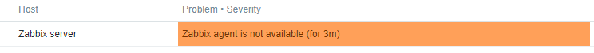
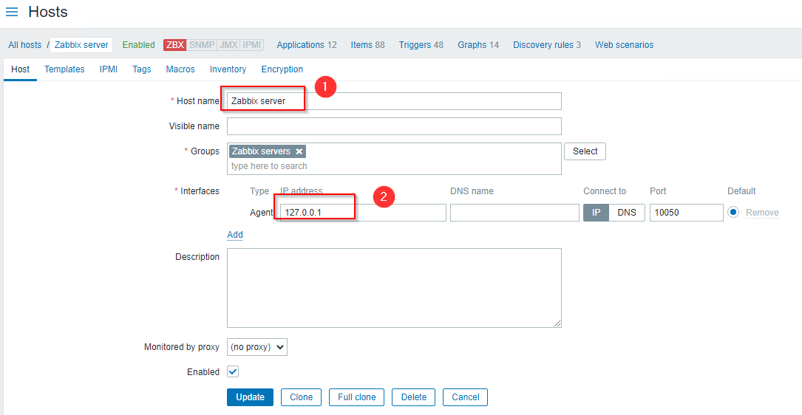

### ISSUE

1. zabbix agent is not available



get zabbix agent ip and hostname from zabbix log:
```
[root@zbx01]# docker logs -f fbf1977895be
...
222:20201013:021151.804 temporarily disabling Zabbix agent checks on host "Zabbix server": host unavailable
204:20201013:021156.497 item "Zabbix server:zabbix[vmware,buffer,pused]" became not supported: No "vmware collector" processes started.
224:20201013:021334.272 cannot send list of active checks to "172.16.239.5": host [f4b9df2490a6] not found
224:20201013:021534.297 cannot send list of active checks to "172.16.239.5": host [f4b9df2490a6] not found
226:20201013:021734.320 cannot send list of active checks to "172.16.239.5": host [f4b9df2490a6] not found
223:20201013:021934.340 cannot send list of active checks to "172.16.239.5": host [f4b9df2490a6] not found
226:20201013:022134.365 cannot send list of active checks to "172.16.239.5": host [f4b9df2490a6] not found
```

and then update IP and hostname on zabbix web:

